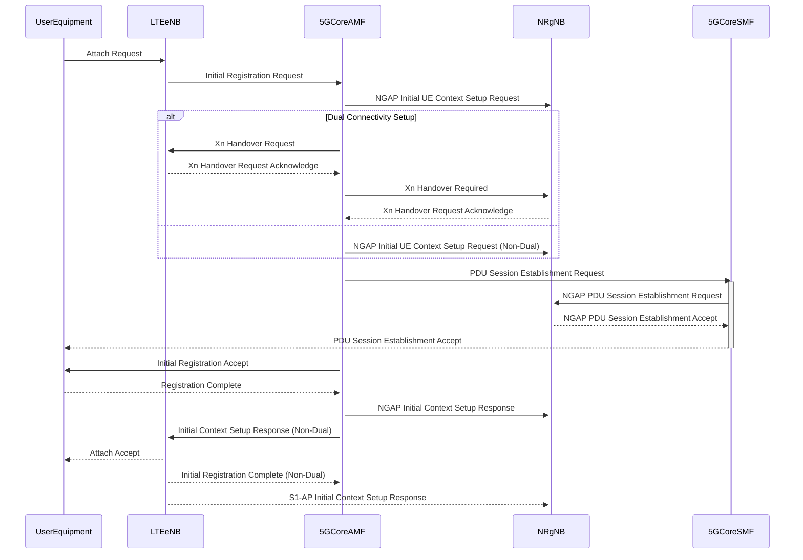
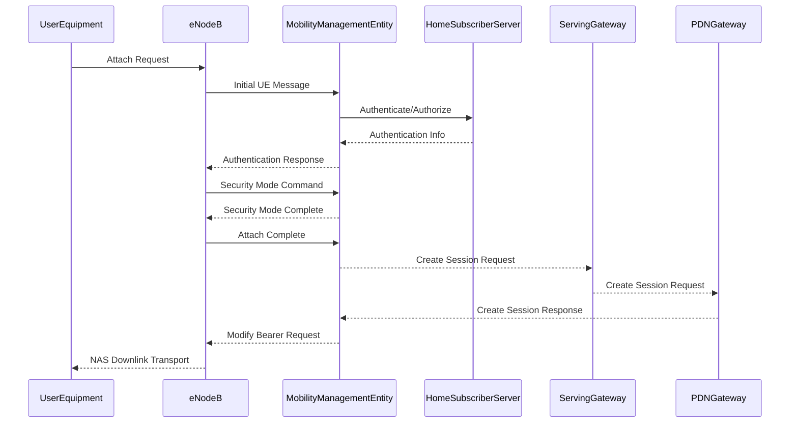
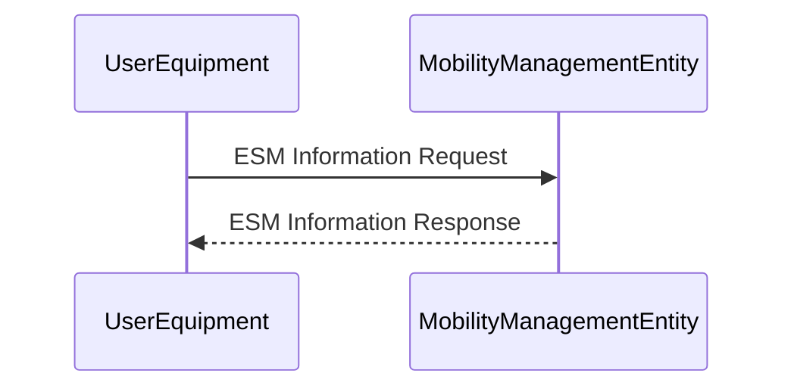

# 5G NSA and SA Lab

### 5G NSA dual connectivity sequence diagram



#### S1AP/NAS-EPS DownlinkNASTransport sequence diagram




### What is the ESM

The ESM Information Request is a message used in the Evolved Packet System (EPS) to request specific information about the EPS Session Management (ESM) context for a mobile device (UE) from the network. This request is part of the NAS (Non-Access Stratum) signaling between the UE and the MME (Mobility Management Entity) in the LTE (Long-Term Evolution) or 5G networks.

Here's a simplified example of how an ESM Information Request might be represented in a sequence diagram using Mermaid syntax:



In this diagram:
- The UE initiates the ESM Information Request to the MME.
- The MME responds with the ESM Information Response, providing the requested information.

Again, this is a simplified representation. In a real-world scenario, the ESM Information Request would include specific parameters or identifiers to request particular information about the ESM context. Refer to the 3GPP specifications for a more accurate and detailed understanding of the ESM Information Request and Response messages in the context of NAS signaling.

### The MIME type "application/vnd.3gpp.5gnas" 

The MIME type "application/vnd.3gpp.5gnas" refers to the content type associated with 5G NAS (Next-Generation Core Network Authentication and Security). This content type is used to identify and handle data payloads related to 5G NAS protocols in communication systems.

In the 3rd Generation Partnership Project (3GPP), which develops standards for mobile telecommunications, the 5G NAS plays a crucial role in handling signaling messages between the User Equipment (UE) and the core network. These signaling messages are essential for functions such as registration, authentication, mobility management, and session establishment.

When you encounter the MIME type "application/vnd.3gpp.5gnas," it typically indicates that the content of the data follows the 3GPP specifications for 5G NAS messaging. This MIME type helps applications and systems identify and process the data according to the expected 5G NAS format.

### nsmf-pdusession/v1/sm-contexts

The string "nsmf-pdusession/v1/sm-contexts" appears to be a URL path or endpoint related to the 5G Next-Generation Service Management Function (nsmf) and PDU Session Management (pdusession) in a network architecture. In 5G networks, the Service Management Function (SMF) is responsible for managing PDU (Packet Data Unit) sessions.

The specific path "v1/sm-contexts" suggests a versioned API endpoint related to the management of the SM contexts (Session Management contexts) within the NSMF for PDU sessions. SM contexts store information about the state and parameters of active sessions, including details about the user's connection and the services being used.

This type of endpoint is commonly used in RESTful APIs to interact with network functions and retrieve or manipulate information related to sessions and contexts in a standardized manner. Developers or administrators may use such endpoints for operations like querying, creating, updating, or deleting SM contexts for PDU sessions.

### gNB, AMF, SMF, and UPF

In 5G networks, gNB, AMF, SMF, and UPF are key network functions responsible for different aspects of the network architecture:

1. **gNB (gNodeB):**
   - **Role:** gNB, or gNodeB, is the base station in the 5G radio access network (RAN).
   - **Function:** It handles the radio communication with user equipment (UE) and manages the radio resources.

2. **AMF (Access and Mobility Management Function):**
   - **Role:** AMF is a core network function responsible for access and mobility management.
   - **Function:** It handles functions related to UE registration, connection setup, mobility management, and security procedures.

3. **SMF (Session Management Function):**
   - **Role:** SMF is a core network function responsible for managing sessions in the 5G core network.
   - **Function:** It manages PDU (Packet Data Unit) sessions, including session establishment, modification, and termination. It plays a crucial role in managing the data sessions of a user.

4. **UPF (User Plane Function):**
   - **Role:** UPF is a core network function responsible for handling the user plane traffic.
   - **Function:** It processes and routes user data packets between the SMF and the external data networks (e.g., the internet). It may also perform functions such as traffic optimization and packet inspection.

In summary, gNB is part of the radio access network, AMF handles access and mobility management, SMF manages session-related functions in the core network, and UPF is responsible for the user plane data processing and routing. Together, these functions play crucial roles in enabling high-speed and low-latency connectivity in 5G networks.

### SUCI, SUPI, IMSI

In 5G networks, SUCI (Subscription Concealed Identifier), SUPI (Subscription Permanent Identifier), and IMSI (International Mobile Subscriber Identity) are identifiers associated with mobile subscribers:

1. **SUCI (Subscription Concealed Identifier):**
   - **Description:** SUCI is used in 5G to enhance user privacy by concealing the actual identity of the subscriber during network authentication procedures.
   - **Function:** It is derived from the SUPI and includes additional protection measures to prevent the exposure of the SUPI. SUCI is used during initial access, registration, and authentication processes.

2. **SUPI (Subscription Permanent Identifier):**
   - **Description:** SUPI is a unique identifier associated with a subscriber's subscription in the mobile network.
   - **Function:** SUPI is used for identification purposes and is part of the subscription information stored in the Home Subscriber Server (HSS) or Authentication and Management Function (AMF) in 5G networks.

3. **IMSI (International Mobile Subscriber Identity):**
   - **Description:** IMSI is a globally unique identifier assigned to a mobile subscriber for identification on a mobile network.
   - **Function:** IMSI has been used in earlier generations of mobile networks, including 2G (GSM), 3G (UMTS), and 4G (LTE). In 5G, the SUPI is introduced to replace the IMSI in certain procedures for enhanced security and privacy.

In summary, SUCI is a concealed version of SUPI designed for improved privacy in 5G, SUPI is the permanent identifier associated with a subscriber's subscription, and IMSI is the international identifier used in earlier generations of mobile networks.

### give a SUCI example

A Subscription Concealed Identifier (SUCI) is derived from the Subscription Permanent Identifier (SUPI) and includes additional protection measures to enhance user privacy. The structure of SUCI includes a Mobile Country Code (MCC), Mobile Network Code (MNC), Routing Indicator (RI), AMF Region ID, AMF Set ID, and Slice ID. Here's an example SUCI:

```plaintext
SUCI: 123-456-RI-7890123456-7890-12
```

In this example:
- MCC: 123 (Mobile Country Code)
- MNC: 456 (Mobile Network Code)
- RI: Routing Indicator (a numerical value)
- AMF Region ID: 7890123456
- AMF Set ID: 7890
- Slice ID: 12

Please note that these values are placeholders, and in a real-world scenario, the actual values would be assigned based on the specific network configuration. SUCI is used in certain procedures, such as during initial access, registration, and authentication, to enhance user privacy by concealing the actual identity of the subscriber.