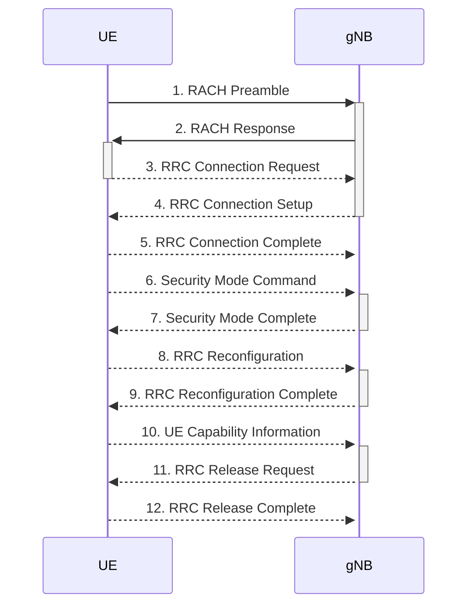
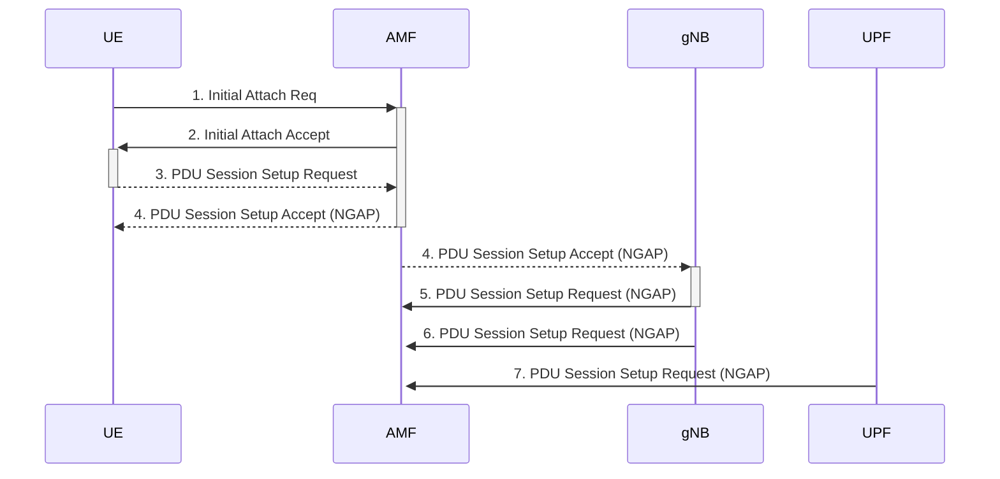

# Lab 0

## 3.1 Deployment

Questions

1. Explain the role of each of the Elements in the deployment.


| Elements | Role |
|-|-|
| oai-amf | The AMF (Access Management Function) is responsible for managing access and mobility for 5G devices |
| oai-db | Database of OAI  |
| oai-gnb | gnode-b |
| oai-smf | The OpenAirInterface Session Management Function |
| oai-upf | Managing session context with the User Plane Function |

 </img>

- [ ] [openverso-charts](https://gradiant.github.io/openverso-charts/open5gs-oaignb.html) &#x1F573;

2. Record the output of the observe by taking a screenshot and add it to your report.

 </img>

## 3.2 PCAP Extraction

Questions

1. Explain what are each of the ports used for in 4G/5G interfaces and show the protocol stack.

**A**: The output is likely from a network diagnostic or monitoring tool, which is capturing real-time data about the radio interface between a 5G NodeB (gNB) and a User Equipment (UE).

In both 4G and 5G networks, each layer of the protocol stack communicates over specific ports/interfaces, and each has its role. Here’s a general overview of the protocol stack and the interfaces involved:

    Physical Layer (PHY): This layer is responsible for the actual transmission of data over the radio frequency. In the context of 5G, this includes the management of the NR (New Radio) air interface.

    MAC (Medium Access Control) Layer: This layer controls how data is placed on and retrieved from the physical medium (in this case, the radio channel). It manages access to the data-carrying channels and handles the multiplexing of the transport channels into physical channels.

    RLC (Radio Link Control) Layer: This layer ensures the reliable transmission of data. It is responsible for the segmentation and reassembly of packets, error correction through ARQ (Automatic Repeat Request), and the maintenance of sequence numbers for in-order delivery.

    PDCP (Packet Data Convergence Protocol) Layer: This layer provides header compression to reduce the size of the IP packet headers for more efficient transport over the air interface. It also provides security functions such as ciphering and integrity protection.

    RRC (Radio Resource Control) Layer: This layer is responsible for the control plane signaling between the UE and the network. It manages the configuration of the lower layers of the protocol stack.


2. How many Logical Channels are created in the gNB? Explain the role of each and connect them to the DRBs.

3. Investigate if there is any user traffic in the PCAP already and if any the type of the traffic (after the UEs readiness).

4. How are we specifying the gNB to wait for the TTracer based on the deployment file?

## 3.3 Traffic Generation

Questions

1. Run the RTT test and record the statistics.

```bash
cli test rtt ue1 -- -c 10 -s 64 8.8.8.8 > ping.log
```

open the file [ping.log](logs/ping.log)

2. Run the RTT command again by replacing the packet size of 64 bytes with 768 bytes and record the statistics.


```bash
cli test rtt ue1 -- -c 10 -s 768 8.8.8.8 > ping.log
```

open the file [ping-768.log](logs/ping-768.log)

3. Compare the two previous results in a bar chart for average, min, max, and standard deviation statistics.

 </img>

4. Explain where does the IP address 12.1.1.1 in the command come from?

```powershell
PING 12.1.1.1 (12.1.1.1) from 12.1.1.4 oaitun_ue0: 768(796) bytes of data.
776 bytes from 12.1.1.1: icmp_seq=1 ttl=64 time=36.5 ms
776 bytes from 12.1.1.1: icmp_seq=2 ttl=64 time=23.8 ms
```

The IP address 12.1.1.1 comes from the gNB container IP address.

5. Run all the throughput tests and record the statistics.

6. Stop the Wireshark capture and save it to a file for further analysis.

7. Run the TCP downlink tests again and use the option --plot before the terminal name to plot the throughput in real-time and record the results by taking a screenshot.

## 3.4 Extract Configuration

As an extra exercise, you can extract the configuration of the gNB as well as some visuals on your deployment. To extract the configuration, use the following command:

```
cli extract config {element} /tmp
```

This will create the configurations in the `/tmp` directory. Keep the configuration for verifying the results of your packet analysis.

[tmp](tmp)

1. Find the configuration file for the gNB and verify the PLMN and slice configuration is applied properly.

```
element=oai-gnb.oai-gnb.eurecom; \
cli extract config ${element} /tmp
```

## 3.6 Questions

For the questions below, when applicable, verify the results both from the configuration or the logs and the PCAP. If one

piece of information is present in multiple messages, please specify all of them and explain the differences.

1. What are the IP address of gNB and AMF?

**A: 12.1.1.1**

2. What is the port number of N2-AMF?

**A: 5201**

3. What is the gNB identity? Explain the difference between the gNB ID and the cell ID.

A:

4. What are the frequency and bandwidth of the gNB?

Given that the bandwidth is 40 MHz, you can use the formula mentioned earlier to calculate the frequency corresponding to the Absolute Radio Frequency Channel Number (ARFCN) 641280. Assuming the frequency band is n78 (3.3 GHz to 3.8 GHz), the calculation would be as follows:

$$ \text{Frequency (Hz)} = 3300000000 + (641280 \times 400000) $$

Let's calculate that:

$$ \text{Frequency (Hz)} = 3300000000 + (641280 \times 400000) $$

$$ \text{Frequency (Hz)} = 3300000000 + 256512000000 $$

$$ \text{Frequency (Hz)} = 256515200000 $$

Therefore, the frequency corresponding to ARFCN 641280 with a bandwidth of 40 MHz in the n78 band would be approximately $256.52$ GHz.

5. What is the subcarrier spacing of the gNB?

subcarrier-spacing: 30kHz

6. What TDD pattern is used by the gNB?

The TDD (Time Division Duplexing) pattern is specified in the provided configuration:

```yaml
tdd-config:
    period: 5ms
    dl-slots: 7
    dl-symbols: 6
    ul-slots: 2
    ul-symbols: 4
```

In this configuration:

- `period: 5ms` indicates that the TDD period is 5 milliseconds.
- `dl-slots: 7` indicates that there are 7 downlink (DL) slots in each TDD period.
- `dl-symbols: 6` indicates that there are 6 symbols in each downlink slot.
- `ul-slots: 2` indicates that there are 2 uplink (UL) slots in each TDD period.
- `ul-symbols: 4` indicates that there are 4 symbols in each uplink slot.

This configuration represents a TDD pattern with a 5 ms period, where the total number of slots is 9 (7 DL slots + 2 UL slots) in each TDD period, and each slot has a specified number of symbols. The downlink and uplink slots alternate in the TDD pattern.

The specific TDD pattern details (e.g., the sequence of DL and UL slots within the TDD period) would depend on the precise configuration used in the network, and it might be specified by standards or network planning parameters. The provided configuration indicates the basic structure of the TDD pattern.

 </img>

7. What preamble index is used for the RACH and what is the type of the RACH?

 there are two types of RACH preambles:

Synchronization Signal (SS) Burst: The SS burst is a type of RACH preamble used for initial cell access and synchronization. It helps the device synchronize with the network and obtain essential information about the cell.

Random Access Preamble (RAP): The RAP is another type of RACH preamble used for random access procedures. When a device needs to establish a connection with the network (e.g., for initial access or in response to a paging message), it sends a RAP.

[SS burst](https://gitlab.eurecom.fr/robert/mobsys/-/blob/main/lab0/tmp/oai-gnb.oai-gnb.eurecom-d78f7d559-qcq2f/gnb.conf?ref_type=heads#L104) is used here according to the logs

8. What are the RNTIs of the connected UE?

| RNTIs | 
|-|
| 80db |
| da11 |

9. What are the IMSIs and PLMNs of the connected UEs?

 </img>

The International Mobile Subscriber Identity (IMSI) and Public Land Mobile Network (PLMN) are crucial identifiers used in mobile communication networks. However, due to privacy and security considerations, the IMSI and PLMN information of connected User Equipments (UEs) is typically not publicly disclosed or accessible.

| Index |      5GMM state      |      IMSI       |     GUTI      | RAN UE NGAP ID | AMF UE ID |  PLMN   | Cell ID |
|-------|----------------------|-----------------|---------------|----------------|-----------|---------|---------|
|      1|   5GMM-REG-INITIATED | 001010000000001 |               |0x             1|          1| 001, 02 |0x  32000|
|      2|   5GMM-REG-INITIATED | 001010000000002 |               |0x             2|          2| 001, 02 |0x  32000|


10. How did the UEs signal its selected PLMN Identities?

- From a predefined list

```yaml
        plmn_list :
        (
            {
                mcc         = 001;
                mnc         = 02;
                mnc_length  = 2;
                snssaiList :
                (
                    {
                        sst = 1;
                        sd  = 0;
                    }
                );
            }
        );
```

11. Which (logical) channels are used during the RACH and RRC connection setup?

During the RACH (Random Access Channel) procedure and RRC (Radio Resource Control) connection setup in 5G networks, several logical channels are involved. Here are the primary logical channels used during these procedures:

1. **PRACH (Physical Random Access Channel):** PRACH is the physical channel used for transmitting random access preamble signals. It is associated with the logical channel RACH.

2. **RACH (Random Access Channel):** RACH is the logical channel that carries random access preamble signals. The PRACH channel is mapped to the RACH logical channel.

3. **PDCCH (Physical Downlink Control Channel):** PDCCH is the physical channel used for downlink control information. It carries DCI (Downlink Control Information), including information related to RRC connection setup.

4. **DCCH (Dedicated Control Channel):** DCCH is the logical channel used for dedicated control signaling between the UE and the gNB. It is used for RRC connection setup, configuration, and other dedicated control purposes.

5. **PCCH (Paging Control Channel):** PCCH is the logical channel used for paging information. It carries messages related to paging, including notifications for incoming calls or messages.

6. **CCCH (Common Control Channel):** CCCH is the logical channel used for common control signaling. It includes common broadcast information and initial access procedures like RACH.

7. **BCCH (Broadcast Control Channel):** BCCH is the logical channel used for broadcasting system information. It includes information about PLMN (Public Land Mobile Network), cell identity, and other essential network parameters.

8. **DL-SCH (Downlink Shared Channel):** DL-SCH is the logical channel used for delivering user data in the downlink direction.

9. **UL-SCH (Uplink Shared Channel):** UL-SCH is the logical channel used for transmitting user data in the uplink direction.

During RACH, the UE uses the RACH logical channel to initiate random access. The gNB responds with allocation information on the PDCCH channel, and subsequent signaling occurs on DCCH. For RRC connection setup, the DCCH is heavily involved, carrying RRC messages for establishing the connection. The BCCH and PCCH may also play roles in broadcasting and paging during these procedures.

12. Map the RRC connection messages to the logical channels and RLC mode.



13. At which message numbers are the UEs connected to the gNB and can start transmitting data?

14. At which message numbers are the UEs disconnected from the gNB and from AMF?

15. Draw the message sequence chart3 and show the messages and their associated network entity (i.e. UE, gNB, AMF).
You could use the chart generator at http://mscgen.js.org. 4



16. Scheduling Request (SR):
• Describe a SR with your own words.
