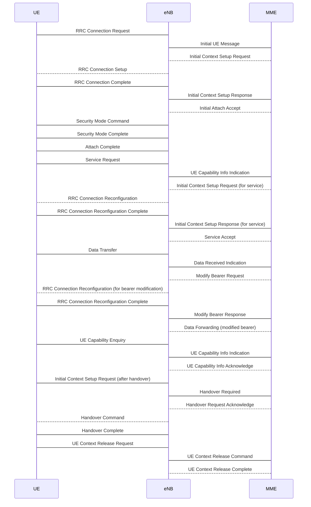
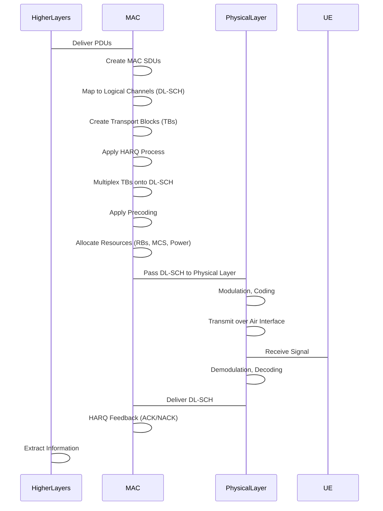

# &#x1F9EA; **Lab $\color{Salmon}1$ **

## $\color{Salmon}3.1$ Deployment and PCAP


#### &#x1F5E3; Questions

##### $\color{Salmon}1.$ Explain the role of each of the Elements in the deployment.

If the question is related to the Kubernetes deployment manifest file `simple-lte.yaml`:

It is composed by 2 Custom Resource Definitions [CRDs](https://kubernetes.io/docs/tasks/extend-kubernetes/custom-resources/custom-resource-definitions/) defined by `trirematics.io`. One is a `network` kind and the other one a `Terminal` both deployed in the `trirematics` namespace.

The `eurecom` k8s Network component defines the  EPC core along with the corresponding access and slices.

```yaml
apiVersion: athena.trirematics.io/v1
kind: Network
metadata:
    name: eurecom
    namespace: trirematics
spec:
    slices:
        -   plmn: "00102"
...
    access:
        -   name: srs-lte
...
    core:
        -   name: core
            stack: 4g-sa
            model: srs/srs-epc
            identity:
                region: 0
                cn-group: 4
                cn-id: 5
    dns:
        ipv4:
            default: 8.8.8.8
            secondary: 8.8.4.4
```

The `srs-ue` k8s Terminal component defines the UE along with the corresponding identities, ...


```yaml
---
apiVersion: athena.trirematics.io/v1
kind: Terminal
metadata:
    name: srs-ue
    namespace: trirematics
spec:
    vendor: srs
    stack: 4g-sa
    model: terminal/srs-sim
    preferred-access: srs-lte.eurecom
    target-cores:
        - core.eurecom
    identity:
        imsi: "001020000000001"
...
```


##### $\color{Salmon}2.$ Record the output of the observe by taking a screenshot and add it to your report.


| Elements | Role |
|-|-|
| [(enb) eNodeB ](https://en.wikipedia.org/wiki/ENodeB) | It is the hardware that is connected to the mobile phone network that communicates directly wirelessly with mobile handsets  |
| [epc](https://en.wikipedia.org/wiki/System_Architecture_Evolution#Evolved_Packet_Core_(EPC)) | the Evolved Packet Core (EPC), also known as SAE Core. The EPC will serve as the equivalent of GPRS networks (via the Mobility Management Entity, Serving Gateway and PDN Gateway subcomponents) |
| [UE](https://en.wikipedia.org/wiki/User_equipment) | user equipment (UE) is any device used directly by an end-user to communicate | 

 </img>


#### &#x1F5E3; Questions

##### $\color{Salmon}1.$  Explain what is each of the ports used for in 4G/5G interfaces and show the protocol stack.

```bash
udp_ports="2123 or 2152 or 5687 or 5847"; \
sctp_ports="38412 or 38472 or 36421 or 36412"; \
filter="(sctp port $sctp_ports) or (udp port $udp_ports)"
```
- [ ] an overview of the protocol stack.

### UDP Ports:
1. **UDP Port 2123:**
   - **Protocol:** GTP (GPRS Tunneling Protocol)
   - **Description:** GTP is used for the transmission of user and control plane data in GPRS (General Packet Radio Service) and UMTS (Universal Mobile Telecommunications System) networks. It is a key protocol for the establishment and maintenance of GPRS and UMTS tunnels.

2. **UDP Port 2152:**
   - **Protocol:** GTP-C (GPRS Tunneling Protocol - Control Plane)
   - **Description:** GTP-C is the control plane component of GTP, responsible for signaling and control functions. It is used to establish, modify, and release tunnels, as well as manage mobility and session information.

3. **UDP Port 5687:**
   - **Protocol:** PMIPv6 (Proxy Mobile IPv6)
   - **Description:** PMIPv6 is a protocol used for enabling network-based mobility management. It allows a mobile node to maintain its IP address when moving between different access networks. This is particularly useful in scenarios where the mobile node doesn't actively participate in the mobility signaling.

4. **UDP Port 5847:**
   - **Protocol:** Mobile IPv6 (Internet Protocol version 6)
   - **Description:** Mobile IPv6 is a standard protocol that enables mobile devices to move across networks while maintaining their IP addresses. It provides a mechanism for transparent routing of packets to and from mobile nodes in a way that is independent of their location in the network.

### SCTP Ports:
1. **SCTP Port 38412:**
   - **Protocol:** S1AP (S1 Application Part)
   - **Description:** S1AP is part of the LTE (Long-Term Evolution) protocol stack and is used for communication between eNodeBs (eNBs) and the Evolved Packet Core (EPC). It handles procedures related to the setup, maintenance, and release of bearers.

2. **SCTP Port 38472:**
   - **Protocol:** X2AP (X2 Application Part)
   - **Description:** X2AP is used for communication between eNodeBs in the LTE network. It supports functions related to the management of handovers and mobility between eNodeBs.

3. **SCTP Port 36421:**
   - **Protocol:** XwAP (Xw Application Part)
   - **Description:** XwAP is part of the LTE interface between evolved NodeBs (eNBs) and small cells. It plays a role in handover and mobility management.

4. **SCTP Port 36412:**
   - **Protocol:** S-GW Control Plane
   - **Description:** This port is likely associated with control plane communication between the eNodeB and the Serving Gateway (S-GW) in the LTE/EPC architecture.

### Protocol Stack Overview:
In 4G and 5G networks, the protocol stack involves multiple layers. Below is a simplified overview:

- **User Plane Stack (Typically UDP):**
  - IP (Internet Protocol)
  - UDP (User Datagram Protocol)
  - GTP (GPRS Tunneling Protocol)

- **Control Plane Stack (Typically SCTP):**
  - IP (Internet Protocol)
  - SCTP (Stream Control Transmission Protocol)
  - S1AP, X2AP, XwAP (Application Parts specific to the interfaces)

Note that the actual protocol stack may vary depending on the specific network architecture and the interfaces involved. The above overview provides a high-level understanding of the protocols and ports mentioned in the context of 4G and 5G networks.


##### $\color{Salmon}2.$  Investigate if there is any user traffic in the PCAP already and if any the type of the traffic (after the UE readiness).

| |
|-|
|  </img> |
|  </img> |
|  </img> |
|  </img> |
|  </img> |
|  </img> |
|  </img> |
|  </img> |

| |
|-|
|  </img> |
|  </img> |


##### $\color{Salmon}3.$  Generate some TCP DL traffic and measure the throughput via the --plot option.

```
cli test throughput srs-ue dl --plot -- gateway --time 180
```
 </img>

```
cli test throughput srs-ue ul --plot -- gateway --time 180
```
 </img>


##### $\color{Salmon}4.$  Explain the differences between the cell configuration of this lab and the previous lab.


```
kubectl exec --namespace trirematics deployment/srs-enb.srs-lte.eurecom --container toolbox -- tcpdump -i any -w - (sctp port 38412 or 38472 or 36421 or 36412) or (udp port 2123 or 2152 or 5687 or 5847)
```

```
cli extract pcap srs-enb.srs-lte.eurecom -- (sctp port 38412 or 38472 or 36421 or 36412) or (udp port 2123 or 2152 or 5687 or 5847)
```

```
cli remove network  ./simple-lte.yaml
```
<pre>
network.athena.trirematics.io "eurecom" deleted
terminal.athena.trirematics.io "srs-ue" deleted
</pre>

- [ ] Start the UI

```
cli test rtt ue1 -- -c 10 -s 768 12.1.1.1
```

```
cli test throughput ue1 dl -- gateway --time 60
```
> Returns:
```sql
------------------------------------------------------------
Client connecting to 12.1.1.1, TCP port 5001 with pid 52 (1 flows)
Write buffer size: 131072 Byte
TOS set to 0x0 (Nagle on)
TCP window size: 16.0 KByte (default)
------------------------------------------------------------
[  1] local 12.1.1.2%oaitun_ue0 port 49813 connected with 12.1.1.1 port 5001 (reverse) (sock=3) on 2023-11-22 15:20:59.814 (UTC)
[ ID] Interval        Transfer    Bandwidth       Reads=Dist
[ *1] 0.00-1.00 sec  3.28 MBytes  27.5 Mbits/sec  1154=1154:0:0:0:0:0:0:0
[ *1] 1.00-2.00 sec  6.09 MBytes  51.1 Mbits/sec  1550=1548:2:0:0:0:0:0:0
[ *1] 2.00-3.00 sec  8.53 MBytes  71.5 Mbits/sec  1907=1884:23:0:0:0:0:0:0
[ *1] 3.00-4.00 sec  8.50 MBytes  71.3 Mbits/sec  1953=1936:17:0:0:0:0:0:0
[ *1] 4.00-5.00 sec  8.60 MBytes  72.1 Mbits/sec  1993=1979:14:0:0:0:0:0:0
[ *1] 5.00-6.00 sec  8.66 MBytes  72.6 Mbits/sec  2302=2295:7:0:0:0:0:0:0
[ *1] 6.00-7.00 sec  8.82 MBytes  74.0 Mbits/sec  2352=2342:10:0:0:0:0:0:0
[ *1] 7.00-8.00 sec  8.62 MBytes  72.3 Mbits/sec  2204=2186:18:0:0:0:0:0:0
[ *1] 8.00-9.00 sec  8.23 MBytes  69.0 Mbits/sec  1413=1378:11:0:0:0:0:0:24
[ *1] 9.00-10.00 sec  8.30 MBytes  69.6 Mbits/sec  1914=1889:18:0:0:1:0:0:6
[ *1] 10.00-11.00 sec  8.43 MBytes  70.7 Mbits/sec  2305=2300:5:0:0:0:0:0:0
[ *1] 11.00-12.00 sec  8.42 MBytes  70.6 Mbits/sec  2130=2113:17:0:0:0:0:0:0
[ *1] 12.00-13.00 sec  8.18 MBytes  68.6 Mbits/sec  1958=1939:19:0:0:0:0:0:0
```

- Restart the cluster by changing the values


```
cli test rtt ue1 -- -c 10 -s 768 12.1.1.1
```
> Returns:
```
cli test throughput ue1 dl -- gateway --time 60 
Device "oaitun_ue0" does not exist.
```

```
cli test rtt ue1 -- -c 10 -s 768 12.1.1.1 
```
> Returns:
```
PING 12.1.1.1 (12.1.1.1) from 12.1.1.2 oaitun_ue0: 768(796) bytes of data.
776 bytes from 12.1.1.1: icmp_seq=1 ttl=64 time=18.2 ms
776 bytes from 12.1.1.1: icmp_seq=2 ttl=64 time=18.5 ms
776 bytes from 12.1.1.1: icmp_seq=3 ttl=64 time=17.9 ms
776 bytes from 12.1.1.1: icmp_seq=4 ttl=64 time=17.2 ms
776 bytes from 12.1.1.1: icmp_seq=5 ttl=64 time=16.7 ms
776 bytes from 12.1.1.1: icmp_seq=6 ttl=64 time=17.5 ms
776 bytes from 12.1.1.1: icmp_seq=7 ttl=64 time=19.8 ms
776 bytes from 12.1.1.1: icmp_seq=8 ttl=64 time=19.3 ms
776 bytes from 12.1.1.1: icmp_seq=9 ttl=64 time=20.5 ms
776 bytes from 12.1.1.1: icmp_seq=10 ttl=64 time=18.0 ms

--- 12.1.1.1 ping statistics ---
10 packets transmitted, 10 received, 0% packet loss, time 9011ms
rtt min/avg/max/mdev = 16.729/18.366/20.493/1.125 ms
```


## 4.1 TDD Pattern

#### &#x1F5E3; Questions



##### $\color{Salmon}1.$  Draw a figure to show each of the patterns for the duration of one frame.

 </img>




##### $\color{Salmon}2.$ On your figure, specify how the value of the min Rx-Tx slots is calculated.

##### $\color{Salmon}3.$  Calculate the total number of symbols in DL and UL per second for each of the patterns.

##### $\color{Salmon}4.$  Calculate the ratio of the DL symbols to the UL symbols for each of the patterns.

##### $\color{Salmon}5.$  Calculate the DL throughput as megabits per symbol for each of the patterns and justify why the values should be
close to each other.

## 4.2 ARFCN

#### &#x1F5E3; Questions

##### $\color{Salmon}1.$  Draw these two cells on a frequency axis. Mark the frequencies in MHz on the axis and show each cell with an interval.

 </img>

##### $\color{Salmon}2.$  Calculate the center frequency of each cell in MHz.

##### $\color{Salmon}3.$  How much of the bandwidth in percentage is overlapping between these two cells, causing interference?

To solve the interference problem, we could take two approaches:
1. Decrease the bandwidth of the second cell to avoid the overlapping.
2. Change the center frequency of the second cell to avoid the overlapping


First go with the first approach and use a 20MHz bandwidth for the second cell. Then measure the DL TCP throughput
again for the duration of 60 seconds for one of the UEs.


#### &#x1F5E3; Questions

##### $\color{Salmon}1.$  Draw these two cells on a frequency axis like before.

##### $\color{Salmon}2.$  Compare the throughput with the previous one and explain the difference.

##### $\color{Salmon}3.$  Considering both cells, would you consider the total throughput has been increased or decreased?

For the second option, consider the following three ARFCN numbers:
• 646000

 </img>

• 642667

 </img>

• 643000


#### &#x1F5E3; Questions

##### $\color{Salmon}1.$  Calculate the center frequency of each option in MHz.

##### $\color{Salmon}2.$  Draw these two cells on a frequency axis like before for each of the options.

##### $\color{Salmon}3.$  Compare the throughput with the previous ones and explain the differences.

## 4.3 Multiple UEs

#### &#x1F5E3; Questions

1. Explain the pattern seen in the plot for the first UE.

 </img>
 </img>
 </img>
 </img>
 </img>
 </img>
 </img>
 </img>
 </img>
 </img>
 </img>


##### $\color{Salmon}2.$  Why adding the second UE has caused the throughput of the first UE to drop, even without any traffic for the second UE?

# References

```
k get all -A | grep -v trirematics | grep service
```
> Returns
```yaml
NAMESPACE     NAME                                                                      TYPE        CLUSTER-IP     EXTERNAL-IP   PORT(S)                                    AGE
default       service/kubernetes                                                        ClusterIP   10.2.192.1     <none>        443/TCP                                    4h28m
gmp-system    service/alertmanager                                                      ClusterIP   None           <none>        9093/TCP                                   4h27m
gmp-system    service/gmp-operator                                                      ClusterIP   10.2.212.221   <none>        8443/TCP,443/TCP                           4h27m
olm           service/operatorhubio-catalog                                             ClusterIP   10.2.216.234   <none>        50051/TCP                                  4h25m
olm           service/packageserver-service                                             ClusterIP   10.2.199.37    <none>        5443/TCP                                   4h25m
trirematics   service/athena-controller-manager-metrics-service                         ClusterIP   10.2.215.108   <none>        8443/TCP                                   4h23m
trirematics   service/athena-dns                                                        ClusterIP   10.2.238.62    <none>        53/UDP                                     4h23m
trirematics   service/athena-operator-service                                           ClusterIP   10.2.226.234   <none>        443/TCP                                    4h23m
trirematics   service/athena-operators-plane                                            ClusterIP   10.2.213.43    <none>        50051/TCP                                  4h24m
trirematics   service/athena-webhook-service                                            ClusterIP   10.2.204.193   <none>        443/TCP                                    4h23m
trirematics   service/flexric-sdl                                                       ClusterIP   10.2.225.119   <none>        3306/TCP                                   4h23m
trirematics   service/odin-controller-manager-metrics-service                           ClusterIP   10.2.208.32    <none>        8443/TCP                                   4h22m
trirematics   service/odin-controller-manager-service                                   ClusterIP   10.2.200.183   <none>        443/TCP                                    4h22m
trirematics   service/odin-operators-plane                                              ClusterIP   10.2.232.244   <none>        50051/TCP                                  4h23m
trirematics   service/odin-webhook-service                                              ClusterIP   10.2.240.29    <none>        443/TCP                                    4h22m
trirematics   service/tss04b2c941-4f0f-05ff-4381-2911fe5a4f19cd3f1724e307500fd991b2a7   ClusterIP   10.2.212.69    <none>        60001/TCP,36421/SCTP,36422/SCTP            38m
trirematics   service/tss162f99aa-ee55-c368-bfce-c24ceb0d54b30dbca16c60564e446f43954f   ClusterIP   10.2.255.175   <none>        60001/TCP,80/TCP,8805/UDP,2152/UDP         38m
trirematics   service/tss4a220919-b902-8eb7-d4d2-08e8e44990a2b899fa0cc203fbebfadea7e5   ClusterIP   10.2.205.31    <none>        60001/TCP,3306/TCP                         38m
trirematics   service/tss7c69bcc6-6cef-9de5-f217-5f19b9024b6eb6d89d266559da9aa69aa2b4   ClusterIP   10.2.202.162   <none>        60001/TCP,5201/TCP                         31m
trirematics   service/tss81534344-b275-1e86-421c-8be5b5f1b0e52217073c6f30fd7e777d4cea   ClusterIP   10.2.208.93    <none>        60001/TCP,5201/TCP                         33m
trirematics   service/tss9c8a657e-3d1e-8b82-287a-31cb9960deb81291779400ad975f39490bd0   ClusterIP   10.2.206.48    <none>        60001/TCP,38412/SCTP,80/TCP,8080/TCP       38m
trirematics   service/tssaa931721-bfba-b9f9-eadf-f8ee761712afd7f4bb41f7fc87689af373a9   ClusterIP   10.2.228.186   <none>        60001/TCP,2152/UDP,500/SCTP                38m
trirematics   service/tssad108cc9-b414-0c53-8d25-f4c5a34f911a89dcb0edf0d052d1e551850a   ClusterIP   10.2.213.198   <none>        60001/TCP,36422/SCTP                       37m
trirematics   service/tssbaf7a540-b953-1a7f-6e3c-bb3402542a79cc0dde524d9f0645b5d537e6   ClusterIP   10.2.198.36    <none>        60001/TCP,3306/TCP,9042/TCP                37m
trirematics   service/tssf948661b-27d5-3273-4511-8215230a21494a112e760ddcb0a987c9fad2   ClusterIP   10.2.231.124   <none>        60001/TCP,80/TCP,9090/TCP,8805/UDP         38m
trirematics   service/tssff9f1ed9-62fa-8621-27f4-a9cc16c716ac0449d6c9c06ae035a6981e2c   ClusterIP   10.2.194.82    <none>        60001/TCP,2152/UDP,38412/SCTP,38472/SCTP   38m
```


