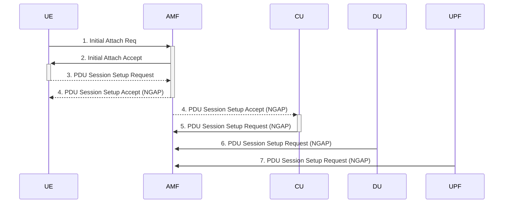

# &#x1F9EA; **Lab $\color{Salmon}2$ **

## ${\color{Salmon}3.1}$ Deployment and Testing

### &#x1F5E3; Questions

#### ${\color{Salmon}1.}$ How do we specify the deployment type of the gNB in the open-ran.yaml file?

Just update the file and change the given parameters 
The kubernetes deployment type is `Network`:

```
apiVersion: athena.trirematics.io/v1
kind: Network
metadata:
    name: o-ran
    namespace: trirematics
```


```yaml
    core:
        -   name: core
            stack: 5g-sa
            model: oai-cn/minimal
            identity:
                region: 0
                cn-group: 4
                cn-id: 5
```


#### ${\color{Salmon}2.}$ How do we specify the CU and DU to be connected to the NearRT-RIC?

Change the yaml code and update the Following parameters.

```yaml
    access:
        -   name: oai-cu-du
            stack: 5g-sa
            model: oai-ran/cu-du
            radio:
                device: rf-sim
            cells:
                -   band: n78
                    arfcn: 640008
                    bandwidth: 40MHz
                    subcarrier-spacing: 30kHz
                    tdd-config:
                        period: 5ms
                        dl-slots: 7
                        dl-symbols: 6
                        ul-slots: 2
                        ul-symbols: 4
            core-networks:
                - core.o-ran
            controller: ric.o-ran
```

```yaml
    edge:
        -   name: ric
            stack: 5g-sa
            model: mosaic5g/flexric-large
        -   name: monitoring
            stack: 5g-sa
            model: mosaic5g/monitoring-c
            profiles:
                 - mac-sm
                 - database
        -   name: sdl
            stack: 5g-sa
            model: mosaic5g/xapps-sdl
```

#### ${\color{Salmon}3.}$ Map the architecture of the network to the O-RAN architecture by mentioning the IP addresses of each component.

Mapping the architecture of a network to the O-RAN (Open Radio Access Network) architecture involves identifying the key components and their respective IP addresses. 

- map network components to the O-RAN architecture with example IP addresses:


O-RU (Radio Unit): This is the radio component responsible for transmitting and receiving radio signals. It connects to the O-DU through fronthaul links.O-DU (Distributed Unit): The Distributed Unit processes the baseband signals received from multiple O-RUs. It connects to the O-CU through midhaul/backhaul links.O-CU (Centralized Unit): The Centralized Unit is responsible for higher-layer processing and can manage multiple O-DUs. It connects to the O-RAN management plane.Management Plane: This is responsible for managing and controlling the O-RAN components. It includes functions like orchestration, configuration, and management.RAN Intelligent Controller (RIC): The RIC enables the intelligent control and optimization of the RAN. It interfaces with the O-CU and O-DU.


1. **O-RAN Central Unit (O-CU):**
   - Component: Central Unit (CU)
   - IP Address: 192.168.1.10

2. **O-RAN Distributed Unit (O-DU):**
   - Component: Distributed Unit (DU)
   - IP Address: 192.168.1.20

3. **O-RAN Radio Unit (O-RU):**
   - Component: Radio Unit (RU)
   - IP Address: 192.168.1.30

4. **O-RAN Near-Real-Time RIC (RAN Intelligent Controller):**
   - Component: Near-Real-Time RIC
   - IP Address: 192.168.1.40

5. **O-RAN Non-Real-Time RIC:**
   - Component: Non-Real-Time RIC
   - IP Address: 192.168.1.50

6. **O-RAN A1 Interface:**
   - Component: A1 Interface (between RIC and gNB)
   - IP Address: 192.168.1.60

7. **O-RAN E2 Interface:**
   - Component: E2 Interface (between CU, DU, and RU)
   - IP Address: 192.168.1.70

8. **O-RAN F1 Interface:**
   - Component: F1 Interface (between CU and DU)
   - IP Address: 192.168.1.80

These IP addresses are placeholders and may not reflect the actual IP addressing scheme used in your network. Additionally, these components may be further distributed or virtualized based on your network architecture. The specific IP addresses and configurations will depend on your network's topology, addressing plan, and the specific O-RAN implementation .

## ${\color{Salmon}3.2}$  F1 Split Questions

Use the PCAP files for the CU and DU to answer the following questions. Choose any MAC-NR message and expand the
Context field and right-click on the Slot, System Frame Number, and Direction, then Apply them as a column.

#### ${\color{Salmon}1.}$ In which message is the cell information transmitted from the DU to CU, and what is the NR cell identity?

#### ${\color{Salmon}2.}$ In which message CU decides on the activated cells?

#### ${\color{Salmon}3.}$ Draw a message sequence chart including the UE, CU, and DU for the random access procedure (messages 1 to 5).
You could use https://plantuml.com/ for drawing the chart.

Creating a message sequence chart to depict the steps involved in setting up a PDU session in 5G involves a series of interactions between the User Equipment (UE), Access and Mobility Management Function (AMF), Central Unit (CU), and Distributed Unit (DU). Please note that this is a simplified representation, and in a real-world scenario, there are additional messages and interactions.

```plaintext
Legend:
- UE: User Equipment
- AMF: Access and Mobility Management Function
- CU: Central Unit
- DU: Distributed Unit
- UPF: User Plane Function
- NGAP: Next Generation Application Part
```

Message Sequence Chart:




Explanation:
1. The sequence begins with the UE initiating the initial attach procedure by sending an Initial Attach Request to the AMF.
2. The AMF processes the Initial Attach Request, and upon successful validation, it sends an Initial Attach Accept back to the UE.
3. The UE then initiates the PDU Session Setup by sending a PDU Session Setup Request (NGAP) to the AMF.
4. The AMF processes the PDU Session Setup Request and forwards the request to the appropriate CU.
5. The CU processes the PDU Session Setup Request and sends a PDU Session Setup Accept (NGAP) back to the AMF.
6. The AMF forwards the PDU Session Setup Accept to the UE.
7. The UE forwards the PDU Session Setup Request (NGAP) to the DU.
8. The DU processes the PDU Session Setup Request and sends a PDU Session Setup Accept (NGAP) back to the UE, indicating that the PDU session setup is successful.

This is a simplified sequence chart, and in a real-world scenario, additional signaling and interactions may be involved. The PDU Session Setup involves coordination between the UE, AMF, CU, DU, and UPF to establish the necessary resources for user data transfer.

#### ${\color{Salmon}4.}$ What is the difference in the random access procedure between the F1 split and without F1 split?

#### ${\color{Salmon}5.}$ Use the protocol stack in the figure 2 to find the pair of the messages for the CU and DU in the PCAP file.

For example, for the RRC Setup Response message in CU, there should be a corresponding F1AP message carrying the
RRC message from CU to DU. These two messages are using different protocol stacks (one F1AP and the other NR-
RRC), but they are paired with each other. `Find the message numbers and the corresponding protocol stack layer
for each pair`.


#### ${\color{Salmon}6.}$ Use the messages in the CU or DU PCAP file to fill the table 1 for each UE, while mentioning the message ID, protocol stack layer, and node type (CU or DU).

#### ${\color{Salmon}7.}$ Since the DU does not process RRC messages, which F1AP message notifies the DU that the RRC connection setup is completed?

#### ${\color{Salmon}8.}$ In which messages the SRB1, SRB2, and DRB1 are setup and through which logical channels?

#### ${\color{Salmon}9.}$ What is the relation between the slot number, direction, and the TDD pattern?

#### ${\color{Salmon}10.}$ What is the maximum System Frame Number?

#### ${\color{Salmon}11.}$ How much time is passed until the System Frame Number resets?

#### ${\color{Salmon}12.}$ Describe the possible handover scenarios in the Open RAN architecture by referencing figure 1.

| UE | RA-RNTI | C-RNTI | gNB-CU | UE-ID | gNB-DU | UE-ID | AMF UE-ID |
|-|-|-|-|-|-|-|-|
| 1 |  |  |  |  |  |  |  |
| 2 |  |  |  |  |  |  |  |

Table 1: F1 Split Messages

### ${\color{Salmon}3.3}$  GTP and RLC Questions

#### ${\color{Salmon}1.}$ Starting from the NGAP PDU session setup request message, draw a message sequence chart to explain the steps to
setup a PDU session including the UE, CU, DU, AMF, and UPF.

#### ${\color{Salmon}2.}$ For the PDU session for each UE, find the 5QI value (written as fiveQI in Wireshark) of its QoS flows, the PDU
session type, and the Allocation and Retention Priority (ARP) level.

#### ${\color{Salmon}3.}$ What is the PDU session Aggregate Maximum Bit Rate (AMBR) for each PDU session?

#### ${\color{Salmon}4.}$ What is the AMBR for each UE?

#### ${\color{Salmon}5.}$ Why there are two separate AMBR defined (even though the values are equal in this case)?

#### ${\color{Salmon}6.}$ Fill the table 2 by the values from the messages above for each of the two UEs.

#### ${\color{Salmon}7.}$ Explain in which order the TEIDs are allocated for each UE.

| UE | UPF TEID | CU to UPF TEID | CU to DU TEID | DU to CU TEID | Assigned IP |
|-|-|-|-|-|-|
| 1 | | | | | |
| 2 | | | | | |

#### ${\color{Salmon}8.}$ How many RLC segments are created for each ICMP packet?

#### ${\color{Salmon}9.}$ How many fragmented IP packets are created for each ICMP message?

#### ${\color{Salmon}10.}$ Now change the packet size to 1200 bytes and answer the questions again.

#### ${\color{Salmon}11.}$ What is different from between the two cases?

#### ${\color{Salmon}12.}$ Find the maximum size for the ICMP packets (the parameter -s) that does not trigger segmentation in RLC.

## ${\color{Salmon}3.4}$  Open RAN Questions

Having a malformed packet for E2 setup request is normal. Your Wireshark version cannot dissect E2AP v2 messages used by FlexRIC.

| E2AP wireshark file and screenshot |
|-|
|  </img> |
| [E2AP wireshark cap file](logs/E2AP.pcapng) |)

#### ${\color{Salmon}1.}$ How many E2-Node(s) connected with the NearRT-RIC?

#### ${\color{Salmon}2.}$ What E2-Node(s) information are included in the E2 Setup Request?

#### ${\color{Salmon}3.}$ We have subscribed to KPM, PDCP, and MAC service models. Explain which E2-Node(s) are subscribed for each service model and measure the RIC indication interval.

#### ${\color{Salmon}4.}$ What are the supported RAN functions in a E2-Node (please explain each E2-Node respectively)?

#### ${\color{Salmon}5.}$ Draw the message sequence chart (use MSCGen again) between NearRT-RIC and a E2-Node (Start from the E2 Setup Request).

#### ${\color{Salmon}6.}$ What is the RIC indication type for each service model?

#### ${\color{Salmon}7.}$ Assuming the value of the inter-arrival for the MAC service model, 

how many records from the database should be recorded to cover the last 45 seconds of both UEs metrics? 

Hint: You could use the filter `e2ap.RANfunctionID == {value}` to filter the records for each Service Model.


# References

```
k delete pod -n trirematics monitoring-c.monitoring.o-ran-5c5859c97d-rsr6m
```
